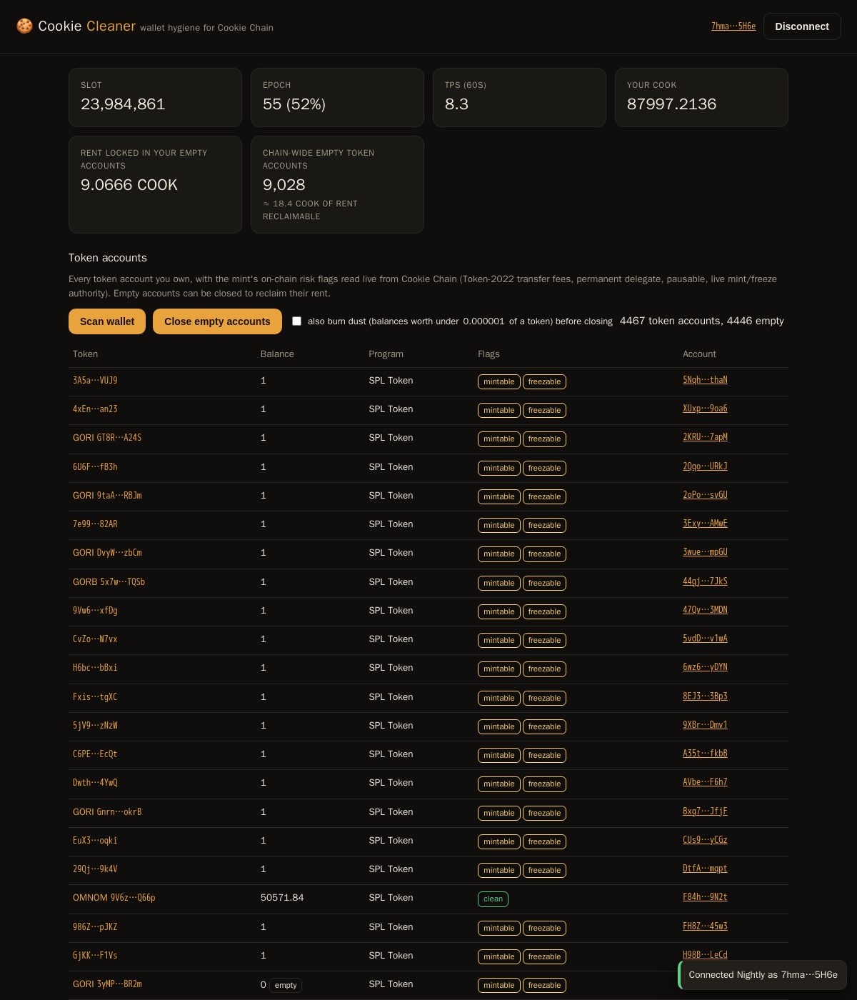

# 🍪 Cookie Cleaner

Wallet hygiene for [Cookie Chain](https://www.cookiechain.wtf/). Connect Nightly, see every token account you own with the mint's on-chain risk flags, close the empty ones to get your rent back, and send COOK, all with live transaction status.

**Live app:** https://sirovensky.github.io/cookie-cleaner/



## Why

As of 2026-09-08, Cookie Chain holds 17,895 SPL token accounts and 9,019 of them are empty. Each one locks 0.00204 COOK of rent-exempt balance, about 18.4 COOK sitting idle chain-wide. Wallets that swap, mint, or receive airdrops accumulate these and rarely clean up. There is no built-in way in most wallets to see or close them.

The second problem is Token-2022 extensions. A mint can carry a transfer tax, a permanent delegate that can pull tokens from any holder, a pause switch, or a live mint or freeze authority. None of that is visible in a balance list. Cookie Cleaner reads the mint account for every token you hold and shows the flags next to the balance.

## What it does

1. **Connect** a Nightly wallet through the Wallet Standard (`window.nightly.solana`), with fallback to any registered Solana wallet or a legacy `window.solana` provider.
2. **Scan** all SPL Token and Token-2022 accounts of the connected wallet and display token name (Token-2022 metadata or Metaplex), balance, program, and mint flags: `transfer tax`, `permanent delegate`, `pausable`, `transfer hook`, `mintable`, `freezable`, or `clean`.
3. **Close empty accounts** in batches of 10 per transaction, with an opt-in **dust burn** (balances under 0.000001 of a token are burned first, after an explicit confirmation) so near-empty accounts can be reclaimed too. Skips frozen accounts and accounts whose close authority is not the wallet. Each transaction is simulated first, then signed by the wallet, sent, and confirmed against the block height; every step shows a toast with an explorer link.
4. **Send COOK** with balance and address validation and the same simulate → sign → send → confirm path.
5. **Chain stats** (slot, epoch progress, TPS, and a live chain-wide count of empty token accounts with the rent they hold) and the wallet's recent signatures with success or failure status.

No backend. The page talks only to `https://rpc.cookiescan.io` from the browser. No keys leave the wallet.

## Run locally

It is a single `index.html`. Open it with any static server:

```
python3 -m http.server 8080
# then http://localhost:8080
```

Nightly setup: open network settings, add a custom SVM network with RPC `https://rpc.cookiescan.io`, switch to it, then click **Connect Nightly**.

## Verify the transaction logic without a wallet

`test_sim.js` rebuilds the exact close-account transaction the app builds for any wallet address and simulates it on Cookie Chain with signature verification off:

```
npm install @solana/web3.js
node test_sim.js <walletAddress>
```

## Addresses

1. Cookie Chain RPC: `https://rpc.cookiescan.io`
2. SPL Token program: `TokenkegQfeZyiNwAJbNbGKPFXCWuBvf9Ss623VQ5DA`
3. Token-2022 program: `TokenzQdBNbLqP5VEhdkAS6EPFLC1PHnBqCXEpPxuEb`
4. System program (transfers): `11111111111111111111111111111111`

## License

MIT
